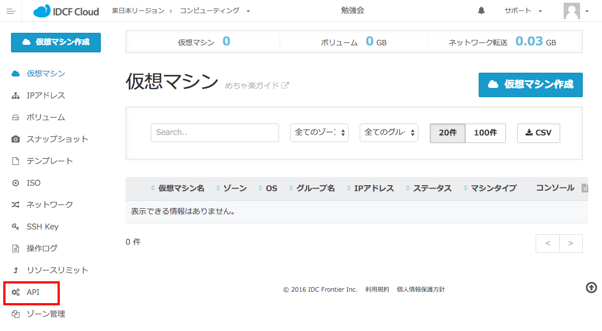
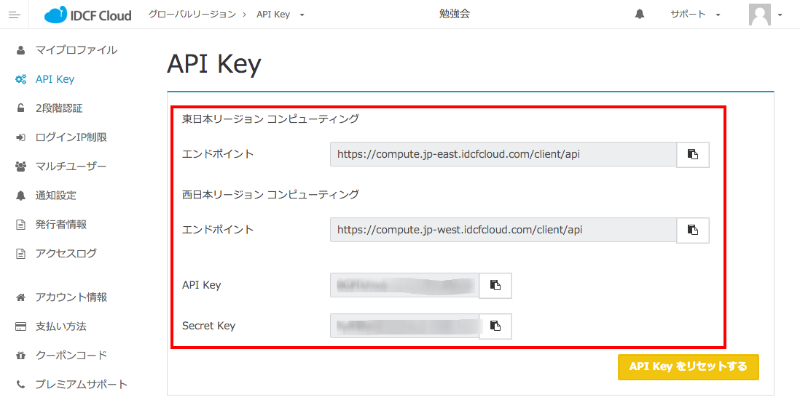

# WordPress構築Playbook - Ansible実行マシン上での手順

## 目次

### Ansible環境準備
  1. VMを作成する
  1. Ansible実行マシンにSSH接続する
  1. 実行マシン上にAnsibleをインストール
  1. Playbookをダウンロード

### IDCFクラウド API(CloudStack)からのVM作成
  1. APIキーを確認する
  1. 接続設定ファイルを作成
  1. Ansibleから自動でVMを作成
  1. 生成されたInventoryファイルを確認

### AnsibleからWordpress環境を作成
  1. ansible-playbookを実行

### AppサーバーとDBサーバーの分割

1. DBサーバーを作成する
  * 新しくDB用サーバーのVMを作成する
  * コントロールマシンからSSH接続できることを確認する
2. インベントリにグループを追加する
3. playbookを編集する
  * site.ymlを編集する
  * mysql roleを編集する
  * wordpress roleを編集する

### [自由課題]Mackerelと連携させる
1. 方針
2. ヒント

## Ansible環境準備

Ansible実行マシンを作成してSSHし、Ansibleをインストールする

### 1. VMを作成する

* Ansible実行マシン用VMを作成する
  * イメージは「CentOS 7.1 64-bit」を使用
  * 名前は「ansible-machine」とする

:warning: IDCFコントロール・パネル操作方法の詳細は、「IDCFクラウド上での手順」スライドを参照

### 2. Ansible実行マシンにSSH接続する

* #### Mac、Linuxの場合

  1. ターミナルを開く
  2. VM作成時に使った秘密鍵のパーミッションを600に変更する

    ```bash
    chmod 600 ssh_private_key
    ```

  3. Ansible実行マシンにSSH接続する

    ```bash
    ssh root@xxx.xxx.xxx.xxx -i ssh_private_key
    ```

* #### Windowsの場合（Tera term使用時）

  1. Tera termを起動する
  2. ホストにはAnsible実行マシンのIPアドレスを入力
  3. ユーザー名は「root」、秘密鍵にはVM作成時に使った秘密鍵を指定

### 3．実行マシン上にAnsibleをインストール

#### yumでAnsibleをインストールする

1. エディタをインストールする
  * vimやemacsに不慣れな方には nano がオススメです

  ```sh
  yum install nano -y
  echo 'set const' >> ~/.nanorc
  ```

2. yumリポジトリにEPELを追加する

  ```
  yum install epel-release -y
  ```

3. Ansible, pipをインストール

  ```
  yum install ansible python-pip -y
  ```

4. CloudStack API操作に必要なPythonライブラリをインストール

  ```bash
  pip install cs sshpubkeys
  ```

4. ansibleコマンドが使用できることを確認する

  ```sh
  ansible[Tab][Tab]
  ansible    ansible-doc    ...    ansible-vault
  ```

### 4. Playbookをダウンロード

今回のハンズオンで使用するplaybookをダウンロードする

1. GitHubの公開リポジトリからgit cloneする

  ```
  git clone --recursive https://github.com/realglobe-Inc/ansible-demo-playbooks.git
  ```

2. cdコマンドを使用しディレクトリを移動する

  ```
  cd ansible-demo-playbooks/wordpress-nginx/
  ```

## IDCFクラウド API(CloudStack)からのVM作成
AnsibleからIDCFクラウドが提供するCloudStack APIを操作して、Wordpress設置用VMを作成します。

:warning: IDCFクラウド以外を使う場合は、以下の条件を満たすCentOS 6, 7系のサーバーが必要
* Ansible実行マシンからrootもしくはsudo権限を持つユーザーでSSH接続可能
* 外部から80番ポート(HTTP)に接続可能

### 1. APIキーを確認する
1. IDCFクラウドのUI上サイドメニューから、**API** をクリック
  

2. **エンドポイント**、**API Key**、**Secret Key** を確認
  (リージョン[東日本、西日本]はAnsible実行マシンと同一リージョンを選びましょう)
  

### 2. 接続設定ファイルを作成
設定ファイル `~/.cloudstack.ini` を作成し、上で確認した値を使って以下のように編集

```
[cloudstack]
endpoint = エンドポイント
key = API Key
secret = Secret Key
timeout = 100
```

### 3. Ansibleから自動でVMを作成
プレイブックを使ってWordpress用VMを作成。SSH鍵の設定、公開IPの取得、ファイアウォール設定なども自動で実行される

```
ansible-playbook -i ./localhost ./prepare_idcf.yml
```

### 4. 生成されたInventoryファイルを確認
プレイブックが正常に完了すると、同じディレクトリに `hosts` と言う名前のファイルが作られる。  
このファイル内に作成されたWordpress用VMへの接続情報が以下のように正しく書き込まれていることを確認。

```
[wordpress-server]
wordpress-server ansible_ssh_host=xxx.xxx.xxx.xxx ansible_ssh_user=root ansible_ssh_private_key_file=~/.ssh/id_rsa-ansible-wordpress-handson
```

`xxx.xxx.xxx.xxx`の部分がWordpressが公開されるときのアドレスになる

:warning: IDCFクラウド以外の場合は、`hosts` ファイルを上記の形式で手動作成する

## AnsibleからWordpress環境を作成

### 1. ansible-playbook実行

1. wordpressをインストールするplaybookを実行

  ```
  ansible-playbook -i ./hosts ./site.yml
  ```

2. ブラウザから`hosts`内に書かれたIPアドレスにアクセスして、Wordpressインストール画面を表示。  
  Wordpressが正常にインストールできる事を確認する。

3. Wordpressをアンインストールするplaybookを実行、環境をクリーンアップする。

  ```
  ansible-playbook -i ./hosts ./clean.yml
  ```

4. Wordpressにアクセスできなくなっていることを確認

# AppサーバーとDBサーバーの分割

先ほど構築したWordpressサーバーは、WebアプリケーションとDBが同じホスト上に乗っている一台構成のものでしたが、プロダクション運用の際にはパフォーマンスや可用性を考慮してアプリケーション・サーバーとDBサーバーを分割した構成を取ることも多いです。  
しかし、今のままのplaybookはこの様な構成に対応していません。  
そこで、ここからはplaybookを編集してアプリ+DBの二台構成Wordpress環境を構築してみましょう！

## 1. DBサーバーを作成する
  1. DBサーバーの要件
    * OSはCentOS7.1で作成
    * DBのバックエンドはCentOS7系デフォルトのMariaDBとする（CentOS6系ではMySQL）
    * SSH KeyはWordpressサーバーと同じものを使用する
    * DBはローカルネットワーク内からのアクセス専用なので、ポート開放の追加設定は必要なし

  2. `prepare_idcf.yml`を編集
    現在`wordpress-server`のみを作成するようになっているので、以下のように`wordpress-db` vmも作成できるようにしましょう。

    ```yaml
    ---
    - hosts: localhost
      connection: local
      roles:
        - role: idcf_vm
          idcf_vm_name: wordpress-server
          idcf_vm_inventory_groups:
            - wordpress-server
          idcf_vm_ssh_key_name: ansible-wordpress-handson
          idcf_vm_ports:
            - port: 80
              protocol: tcp
        # 追記ここから
        - role: idcf_vm
          idcf_vm_name: wordpress-db
          idcf_vm_inventory_groups:
            - wordpress-db
          idcf_vm_ssh_key_name: ansible-wordpress-handson
        # 追記ここまで
      tasks:
        - name: Inventory設定をhostsに書き出し
          template:
            src: "{{ playbook_dir }}/templates/hosts.j2"
            dest: "{{ playbook_dir }}/hosts"
            backup: yes
      ```

  3. プレイブック実行
    編集した`prepare_idcf.yml`を`ansible-playbook`コマンドから実行しましょう。

    ```
    ansible-playbook -i ./localhost ./prepare_idcf.yml
    ```

  4. Inventoryファイルを確認
    Inventoryに`wordpress-db`の情報が追加されているか、 `hosts` を確認してみましょう。

    ```
    [wordpress-db]
wordpress-db ansible_ssh_host=xxx.xxx.xxx.xxx ansible_ssh_user=root ansible_ssh_private_key_file=~/.ssh/id_rsa-ansible-wordpress-handson

    [wordpress-server]
wordpress-server ansible_ssh_host=xxx.xxx.xxx.xxx ansible_ssh_user=root ansible_ssh_private_key_file=~/.ssh/id_rsa-ansible-wordpress-handson
    ```

    このように、`wordpress-db`, `wordpress-server`両方のホスト情報が書かれていればOKです。

## 2. playbookを編集する

### site.ymlを編集し、DBサーバーの設定手順、アプリケーション・サーバーの設定手順を分割する

DBサーバー、アプリケーション・サーバー毎に必要なロールが異なることに注意してください。  
また、効率化のために共通の`common`ロールを先に実行している点もポイントです。

* site.yml

  ```yaml
  ---
  - name: 共通のタスクを実行
    hosts: all
    sudo: yes
    roles:
      - common

  - name: MySQLをインストール
    hosts: wordpress-db
    sudo: yes
    roles:
      - mysql

  - name: Wordpress, Nginx, PHP-FPMをインストール
    hosts: wordpress-server
    sudo: yes
    roles:
      - nginx
      - php-fpm
      - wordpress
  ```

### mysql操作系のタスクの実行場所を移動する

元のプレイブックでは、DBもアプリケーションも同じサーバー内に存在したため、Wordpressが使うデータベースと接続ユーザーの設定を`wordpress`ロール内で実行していました。  
このままだと、DBサーバーとアプリケーション・サーバーが分かれた時に設定ができなくなってしまうので、これらの操作を`mysql`ロールに移しましょう。

* 以下2タスクを`roles/wordpress/tasks/main.yml`から`roles/mysql/tasks/main.yml`の最後尾に移動する

  ```yaml
  - name: Wordpress用データベースを作成
    mysql_db:
      name: "{{ wp_db_name }}"
      state: present

  - name: Wordpress用データベースユーザーを作成
    mysql_user:
      name: "{{ wp_db_user }}"
      password: "{{ wp_db_password }}"
      priv: "{{ wp_db_name }}.*:ALL"
      host: localhost
      state: present
  ```

### DBがアプリケーション・サーバーからの接続を受け入れる様にする

上で移動した2タスクの内、`Wordpress用データベースユーザーを作成`タスクをよく見てみると、`host: localhost`と書いてあります。  
これはデータベース・ユーザーの接続元ホストを制限するための設定なので、アプリケーション・サーバーからの接続を受け入れるように書き換える必要があります。

* `roles/mysql/tasks/main.yml`の最後のタスクを書き換え

  ```yaml
  - name: Wordpress用データベースユーザーを作成
    mysql_user:
      name: "{{ wp_db_user }}"
      password: "{{ wp_db_password }}"
      priv: "{{ wp_db_name }}.*:ALL"
      host: "{{ hostvars[item].ansible_default_ipv4.address }}"
      state: present
    with_items: groups['wordpress-server']
  ```

  長い書き方になってしまいますが、この様に書くことで「`wordpress-server`グループに属する全ホストのipアドレス」を動的に設定することができ、冗長化などの際のplaybookの汎用性を高めることができます。
  なお、`with_items`はplaybook内のタスクをループさせる時に使う書き方です。

### WordpressからDBサーバーに接続できる様にする

Wordpressの設定ファイル`wp-config.php`の中にDBのホスト名の設定がありますが、ここも`localhost`になっているので修正しましょう。  
`Wordpress用データベースユーザーを作成`の修正と同様の書き方ができますが、今度はDBサーバーのipを取りたいので`wordpress-db`グループの設定を取得します。  
また、DBサーバーについてはアプリケーション・サーバーの様に単純に全ホストの値をループで設定することはできませんので、今回はDBサーバーは1台である前提とします。

* `roles/wordpress/templates/wp-config.php`を修正する

  ```php
  /** MySQL hostname */
define('DB_HOST', 'localhost');
  ```

  を、以下の様に書き換え

  ```php
  /** MySQL hostname */
  define('DB_HOST', '{{ hostvars[groups['wordpress-db'][0]].ansible_default_ipv4.address }}');
  ```

### ansible-playbookを実行して、ブラウザからアクセスし、wordpressをセットアップする

```bash
ansible-playbook -i ./hosts ./site.yml
```

これでDBサーバー、アプリケーション・サーバーの2台構成のWordpress環境の完成です！

# [自由課題]Mackerelと連携させる

## 1. 方針
今回のWordpress構築用には、今の段階では使われていないMackerelエージェント・インストール用ロール `mackerel` が含まれています（`roles/mackerel`内）。  
このロールを有効化することで、自動で構築したホストをMackerelに登録することが可能となります。

## 2. ヒント
* `site.yml`中 **共通のタスクを実行** の`roles`内に`mackerel`ロールの呼び出しを加えましょう。
* Mackerel連携には`mackerel_api_key`変数の設定が必要です。今回は`ansible-playbook`コマンドのオプションで変数を設定してみましょう

  ```bash
  ansible-playbook -i ./hosts -e "mackerel_api_key=YourApiKey" ./site.yml
  ```

  の形式で実行することができます。

`mackerel`ロール実行完了後にMackerelのダッシュボードを見ると、登録ホストに`wordpress-server`と`wordpress-db`が増えていることが確認できます。
